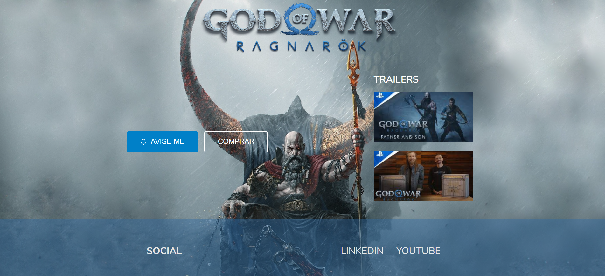

# Landing page - GOD OF WAR - RAGNAROK

Esse projeto foi desenvolvimento para fins estudantils. Desde que começei a trabalhar com frameworks js meu primeiro contato profissional foi vom Vuejs, mas acabei deixando de lado e migrado para o Reactjs que é onde estou até hoje. Então resolvi tentar criar alguma coisa com vuejs tendo como base meu conhecimento em Reactjs(que foi mais util que eu pensei) e a documentação do framework. 

# Tema

GOD OF WAR é uma franquia de jogos que eu sou apaixonada e tenho estanpada na pele. E com o anuncio da data de lançamento do próximo jogo da saga(talvez o ultimo?) resolvi criar uma landing page com o tema do game. 

# Tecnologias

Usei nessa brincadeira o :

- Vuejs

E para hospedar o projeto o:

- Netlify

# Preview

# Deploy

<a href="https://rebecca-gow-ragnarok.netlify.app/" target="_blank"> Ver o projeto em live </a>